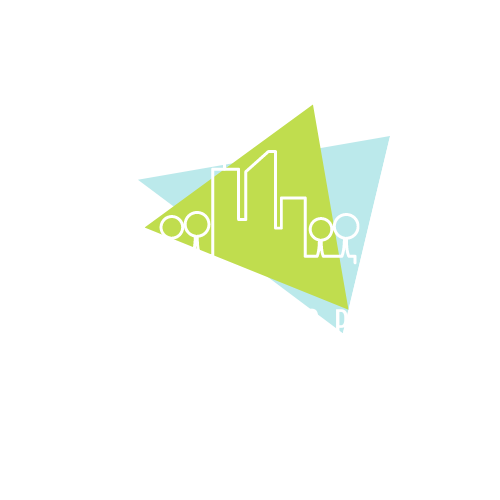

  

# OneShop Rental Service

Welcome to OneShop Rental Service, the platform for finding and renting all kinds of products and equipment. 

## Features
- Browse a wide range of items available for rent
- Filter by category, price, and location
- View item photos and descriptions
- Contact owners and rent items directly through the app
- Leave ratings and reviews for your rentals
- Easy and convenient payment options

## How to use
1. Download the app from the App Store or Google Play
2. Sign up for an account and provide your payment information
3. Search for items in your desired location or category
4. Filter the results by price and location
5. Contact the owner to rent the item
6. Make your payment through the app
7. Enjoy your rental and don't forget to leave a review!

## Tips
- Contact the owner before renting to ask any questions and clarify the details of the rental
- Carefully read the item description and any terms and conditions before renting
- Leave a review after your rental to help other users make informed decisions

## Contact Us
For any questions or feedback, please don't hesitate to reach out to us at harrisonderick.65@gmail.com We hope you have a great experience using OneShop Rental Service!
